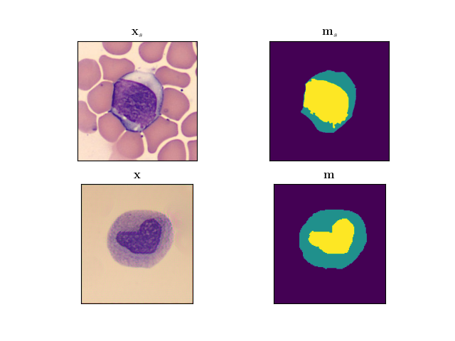

```{r setup, include=FALSE}
knitr::opts_chunk$set(echo = TRUE)
```

# Introduction
This project aims to adapt the work of Scalbert et al. to the generation of synthetic white blood cell (WBC) micrographs. The cells we hope to generate appear quite different than the urothelial cells generated by Scalbert et al. Regardless, we expect that their method can be adapted to WBC generation by simple tuning of hyperparameters.

# Dataset
We are using the `segmentation_WBC` dataset, which is split up by source and consists of the following images.

|Subset #|Image Count|Image Size    |Source                           |
|-------:|----------:|-------------:|:--------------------------------|
|1       |300        |$120\times120$|Jiangxi Tecom Science Corporation|
|2       |100        |$300\times300$|CellaVision                      |

Each image comes with a semantic segmentation mask which was drawn by a field expert. These masks contain annotations for the cytoplasm, nucleus, and background regions.

<center></center>

# Theory

## Elliptic Fourier shape descriptors
Elliptic Fourier shape descriptors (EFSDs) describe contours as sums of ellipses. Each EFSD is represented by two DC components, $A_0$ and $C_0$, as well as four types of harmonic coefficients $a_n$, $b_n$, $c_n$, $d_n$. The original curve can be expressed in terms of these coefficients using the following infinite sum.

$$\begin{aligned}
  x(t) &= A_0 + \sum_{n=0}^\infty\left[a_n\cos\frac{2\pi nt}{T} + b_n\sin\frac{2\pi nt}{T}\right] \\ 
  y(t) &= C_0 + \sum_{n=0}^\infty\left[c_n\cos\frac{2\pi nt}{T} + d_n\sin\frac{2\pi nt}{T}\right] \\
\end{aligned}$$

The DC components can be found using $$\begin{aligned}
  A_0 &= \frac{1}{T}\sum_{p=1}^K\left[\frac{\Delta x_p}{2\Delta t_p}(t^2_p-t^2_{p-1}) + \xi_p(t_p-t_{p-1})\right] \\
  C_0 &= \frac{1}{T}\sum_{p=1}^K\left[\frac{\Delta y_p}{2\Delta t_p}(t^2_p-t^2_{p-1}) + \delta_p(t_p-t_{p-1})\right] \\
\end{aligned},$$ and the harmonic coefficients with $$\begin{aligned}
  a_0 &= \frac{T}{2\pi^2n^2}\sum_{p=1}^K\frac{\Delta x_p}{\Delta t_p}\left(\cos\frac{2\pi nt_p}{T}-\cos\frac{2\pi nt_{p-1}}{T}\right) \\
  b_0 &= \frac{T}{2\pi^2n^2}\sum_{p=1}^K\frac{\Delta x_p}{\Delta t_p}\left(\sin\frac{2\pi nt_p}{T}-\sin\frac{2\pi nt_{p-1}}{T}\right) \\
  c_0 &= \frac{T}{2\pi^2n^2}\sum_{p=1}^K\frac{\Delta y_p}{\Delta t_p}\left(\cos\frac{2\pi nt_p}{T}-\cos\frac{2\pi nt_{p-1}}{T}\right) \\
  d_0 &= \frac{T}{2\pi^2n^2}\sum_{p=1}^K\frac{\Delta y_p}{\Delta t_p}\left(\sin\frac{2\pi nt_p}{T}-\sin\frac{2\pi nt_{p-1}}{T}\right) \\
\end{aligned}.$$

The integer $K$ describes the number of harmonic coefficients included in the EFSD and determines how faithfully the contour will be reconstructed. By lowering $K$, one can easily find an approximation to the original curve, since the higher harmonics represent increasingly finer-grained features of the contour.

## Total variation loss
Total variation (TV), in the context of an image, quantifies the amount of variation between neighboring pixels. Minimizing the TV of an image is synonymous with noise reduction. During texture transfer, we consider the total variation of the generated image as a component of the loss.

$$\mathcal{L}_\text{TV}(\mathbf{x}) = \frac{1}{CHW}\sum_{i,j}\sqrt{(\mathbf{x}_{i+1,j}-\mathbf{x}_{i,j})^2+(\mathbf{x}_{i,j+1}-\mathbf{x}_{i,j})^2}$$

## Markov random field loss
Consider two feature maps, $f,g\in\mathbb{R}^{H\times W\times C}$, where $H\times W$ is the image size and $C$ is the number of channels. First, we split each feature map into $N\times M\times C$ neural patches. Each neural patch in $f$ will have a nearest neighbor patch in $g$, the index of which can be found by minimizing the mean-squared error (MSE) between patch values. This correspondence results in a first-order Markov model, where each neural patch in $f$ depends only on a single neural patch in $g$. Note that this does not simply cause the images to become identical, since nearest neighbor patches need not be neighbors in space.

## Doodle-style texture transfer
In doodle-style texture transfer, we seek to generate an image $\mathbf{x}^*$ that satisfies $$\mathbf{x}^* = \mathop{\mathrm{argmin}}_\mathbf{x} \mathcal{L}(\mathbf{x}_s,\mathbf{m}_s,\mathbf{x},\mathbf{m}_c),$$ where $\mathcal{L}$ is a loss function consisting of $$\mathcal{L}(\mathbf{x}_s,\mathbf{m}_s,\mathbf{x},\mathbf{m}_c) = \mathcal{L}_{MRF}(\mathbf{x}_s,\mathbf{m}_s,\mathbf{x},\mathbf{m}_c) + \lambda\mathcal{L}_{TV}(\mathbf{x}).$$ As parameters, we have $\mathbf{x}_s$ representing the style exemplar, $\mathbf{m}_s$ representing the style mask, $\mathbf{x}$ as the generated image, and $\mathbf{m}$ as its segmentation mask. The MRF loss component is defined as follows. $$\mathcal{L}_{MRF}(\mathbf{x}_s,\mathbf{m}_s,\mathbf{x},\mathbf{m}_c) = \sum_{l=1}^L\left(\sum_p\lVert\psi^l_p(\mathbf{x},\mathbf{m}_c)-\psi^l_{NN(p)}(\mathbf{x}_s,\mathbf{m}_s)\rVert^2\right)$$

The function $\psi^l_p$ is a bit complicated. It takes two arguments, an image and a segmentation mask. It passes the image through a VGG neural network and extracts intermediate activations. The segmentation mask is downsampled to be size-compatible with the VGG feature maps. Then, the feature maps and downsampled segmentation maps are concatenated along the channel dimension and patches extracted. $NN(p)$ just refers to the nearest-neighbor patch of the patch at index $p$. We can find these nearest neighbbors using $$\psi^l_{NN(p)}(\mathbf{x}_s,\mathbf{m}_s) = \mathop{\mathrm{argmax}}_{\psi^l_i(\mathbf{x}_s,\mathbf{m}_s)\in\psi^l(\mathbf{x}_s,\mathbf{m}_s)}\left(\frac{\psi^l_p(\mathbf{x},\mathbf{m}_c)\cdot\psi^l_i(\mathbf{x}_s,\mathbf{m}_s)}{\lVert\psi^l_p(\mathbf{x},\mathbf{m}_c)\lVert\cdot\rVert\psi^l_i(\mathbf{x}_s,\mathbf{m}_s)\rVert}\right),$$ which amounts to a normalized cross-correlation between patches, followed by a channelwise argmax. Once we have found neighboring patches, we can compute the MRF loss as described in the previous section.

# Procedure
The micrograph generation routine is accomplished in two steps: segmentation mask generation, and texture transfer. Scalbert et al. have made a `Python/TensorFlow` implementation of their cell generation procedure available alongside their original paper. In order to gain a better understanding of the algorithm, and to better address any WBC-specific problems we may encounter, we have chosen to rewrite all of the code in `Python/PyTorch`. The two steps, as well as the `Python` implementation, are discussed in detail in the following sections.

## Preprocessing
We opted to join the two subsets and instead partition on WBC class. For simplicity, we only consider WBCs with a single nuclear lobe. There are two types of preprocessing that must be performed: extraction of nucleus and cytoplasm contours for mask generation, and normalization for texture transfer. These preprocessing steps are both discussed here.

First, we need to extract boundary contours. The semantic segmentation maps are already provided, so we sample each region along its boundary at a constant interval. This is accomplished by using `OpenCV` to sample the boundaries at the pixel level, and `NumPy` to downsample and interpolate. Then, for texture transfer, we must normalize the style and target images using the mean and standard deviation that the VGG19 network was trained on. Normalization is accomplished as part of the VGG19 network pipeline, using `PyTorch`.

## Segmentation mask generation
The goal of this step is to produce novel segmentation masks, given the set of segmentation masks corresponding to a given WBC class. We begin by performing the segmentation mask preprocessing previously described, producing equal-length lists of contours for each nucleus and cytoplasm. Then, we convert each pair of contours into EFSDs and concatenate them. This leaves us with a concatenated pair of EFSDs describing each original segmentation mask.

A Gaussian mixture model (GMM) is then fit to the set of concatenated EFSDs, and sampled to produce novel shape descriptors. Of course, these shape descriptors must then be split and inverted in order to obtain usable spatial coordinates. The GMM training is performed in `train.py`. In order to produce the example mask model, we called `train.py` with the following parameters.

```
python3 train.py \
  --output ./models/mask_model.pkl \
  --types neutrophil
```

This produces a model describing neutrophil morphology, and serializes it as `mask_model.pkl`. Then, we use `generate.py` to produce samples from the model and convert them into segmentation masks. In our example, `generate.py` was called using the following syntax, producing 4 segmentation masks.

```
python3 generate.py \
  --model ./models/merged_mask_model.pkl \
  --output-prefix ./images/mask_ \
  --count 4
```

## Image generation
The conversion from a semantic segmentation mask to a WBC micrograph is accomplished using doodle-style texture transfer. We are given a style image and its segmentation mask, along with a target segmentation mask. We would like to generate an image using the target mask and the textures from the style image. We start by initializing the target image with uniform random pixels. We then pass the target and style images through a pre-trained VGG19 neural network, extracting feature maps, from $L$ convolutional layers. At the same time, we pass both masks through a network of successive average poolings, designed to make the segmentation masks size-compatible with the feature maps. We then concatenate the feature maps with the downsampled segmentation masks. These semantic layers are embedded with information about the distribution of each texture type in the image. Now when we find nearest neighbor image patches, as described in **Doodle-style texture transfer**, we are guided by the semantic layers. For example, this forces patches in the nucleus of the target to match with patches in the nucleus of the reference, despite the fact that the two nucleii likely differ in both shape and position.

The texture transfer routine is realized in a commnandline utility called `doodle.py`, which was called with the following arguments to produce the example images. 

```
python3 doodle.py \
  --style-image <style_image> \
  --style-mask <style_mask> \
  --content-mask <content_mask> \
  --output-image <output_image> \
  --iterations 100 \
  --style-weight 150 \
  --tv-weight 10000
```

To help with debugging, `doodle.py` has an option to log statistics and intermediate target images to `tensorboard`. This allows the progress of the optimization to be visualized.

# Conclusion

## Mask generation results
Variation in the generated segmentation masks seemed to be dependent on the number of examples used to train the GMM. Using WBC classes with few members sometimes caused the model to output one of the examples it was trained on, which is clearly undesirable. Otherwise, most of the generated masks looked plausible, and contained the nucleus entirely within the cytoplasm. This may be due to the fact that we forewent EFSD normalization, which seemed to allow the GMM to learn the DC components and relative scales.

## Texture transfer results
The texture transfer model was able to transfer most major features from the style image, but seemed to lack the patch variation present in real WBC micrographs. This caused some of the reproduced cytoplasm textures to be unrealistically uniform. This can be partially helped by shuffling patches before matching, however the results are still somewhat unsatisfactory for complicated WBCs, like the neutrophils in `segmentation_WBC`. It could be that this lack of variation comes from a failure to transfer larger features, such as those that make up the characteristic WBC cytoplasm color patches from the first dataset. This can be seen in the results from the second dataset, which have reproduced the fine details quite well. Even in those examples, however, the model has trouble transfering sparse textures, such as the red blood cells in some of the backgrounds.


<center></center>
<center></center>
<center></center>
<center></center>

Otherwise, we found that the best results came from including one of the first VGG19 convolutional layers in the optimization. Without one of these layers, the colors will not be reproduced correctly, and the image will be noisy. Ultimately, we settled on a weighted combination of the layers `conv_n_2`, where $n\in\{1,2,3,4,5\}$. One caveat to this procedure is that the texture areas need to be in relatively equal proportions in the style and generated images. For example, we get the following nonsense result when we don't adhere to this rule.

<center></center>

Really, the only way around this is to choose a better style image. We could try a crop to equalize the areas, or weight the smaller semantic areas higher, but ultimately we cannot transfer texture that does not exist.

# References
1. Kuhl, F. P., &amp; Giardina, C. R. (1982). Elliptic fourier features of a closed contour. Computer Graphics and Image Processing, 18(3), 236–258. https://doi.org/10.1016/0146-664x(82)90034-x 
2. Scalbert M, Couzinie-Devy F, Fezzani R. Generic Isolated Cell Image Generator. Cytometry A. 2019 Nov;95(11):1198-1206. doi: 10.1002/cyto.a.23899. Epub 2019 Oct 8. PMID: 31593370; PMCID: PMC6899488.
3. Zheng, X., Wang, Y., Wang, G., & Liu, J. (2018). Fast and Robust Segmentation of White Blood Cell Images by Self-supervised Learning. Micron, 107, 55–71. doi:10.1016/j.micron.2018.01.010
4. Li, C., and Wand, M. 2016. Combining markov random fields and convolutional neural networks for image synthesis. abs/1601.04589.
5. Champandard, A. 2016. Semantic Style Transfer and Turning Two-Bit Doodles into Fine Artworks. arXiv:1603.01768 

# Author contributions
Andrew Byers is the sole author of this project.

# Appendix
The source code is original, unless otherwise commented. Most of the texture transfer code is a translation of Scalbert et al.'s original `Python` using `Tensorflow` into `Python` using `PyTorch`. The code is reproduced here, but is also hosted on [GitHub](http://www.github.com/andy-byers/wbc-micrograph-generation).

## `dataset.py`
```
import os

import cv2 as cv
import numpy as np
from PIL import Image


class SegmentationWBC:
    def __init__(self, root, contour_length=64):
        root_fmt = os.path.join(root, 'segmentation_WBC')
        data_fmt = os.path.join(root_fmt,  'Dataset {}')
        type_fmt = os.path.join(root_fmt, 'Class Labels of Dataset {}.csv')
        cells, masks, types = [], [], []

        # Extract and combine entries from each of the two datasets.
        for i in range(2):
            data_dir = data_fmt.format(i + 1)
            type_file = type_fmt.format(i + 1)
            for path in sorted(os.listdir(data_dir)):
                with Image.open(os.path.join(data_dir, path)) as im:
                    # The cell images are stored as BMPs and the segmentation masks as PNGs.
                    (cells if path.endswith('.bmp') else masks).append(np.array(im))
            # Parse the CSV containing the WBC types.
            types.append(np.genfromtxt(type_file, skip_header=True, delimiter=',', dtype=int)[:, 1])

        for index, (mask, cell) in enumerate(zip(masks, cells)):
            nonzero = np.vstack(np.where(mask != 0)).T
            bounds0 = np.min(nonzero, axis=0)
            bounds1 = np.max(nonzero, axis=0)
            masks[index] = mask[bounds0[0]:bounds1[0]+1, bounds0[1]:bounds1[1]+1]
            cells[index] = cell[bounds0[0]:bounds1[0]+1, bounds0[1]:bounds1[1]+1]

        self.types = []
        self.masks = []
        self.cells = []
        self.contours = []

        for i, wbc_type in enumerate(np.concatenate((types[0], types[1]))):
            cc, nc = self.process_mask(masks[i])
            # For simplicity, we're only considering WBCs with one distinct
            # nuclear body.
            if len(nc) == 1:
                self.contours.append((
                    self.downsample_contour(np.squeeze(cc[0]), contour_length),
                    self.downsample_contour(np.squeeze(nc[0]), contour_length),
                ))
                self.types.append(wbc_type)
                self.masks.append(masks[i])
                self.cells.append(cells[i])

    def fetch_contours(self, wbc_type):
        return self._fetch(self.contours, wbc_type)

    def fetch_cells(self, wbc_type):
        return self._fetch(self.cells, wbc_type)

    def fetch_masks(self, wbc_type):
        return self._fetch(self.masks, wbc_type)

    def _fetch(self, target, wbc_type):
        return [target[i] for i, t in enumerate(self.types) if t == wbc_type]

    @staticmethod
    def downsample_contour(pt, length):
        assert length < pt.shape[0]
        # Make sure the curve is closed.
        if not np.allclose(pt[0], pt[-1]):
            pt = np.append(pt, [pt[0, :]], axis=0)
        target = np.linspace(0, 1, length)
        source = np.linspace(0, 1, pt.shape[0])
        return np.vstack((
            np.interp(target, source, pt[:, 0]),
            np.interp(target, source, pt[:, 1]),
        )).T

    @staticmethod
    def process_mask(mask):
        m1 = (mask == 128).astype(np.uint8) * 255
        m2 = (mask == 255).astype(np.uint8) * 255

        # Fill in where m2 was in m1.
        m1[m2 == 255] = 255

        # Get the exact boundary pixels from each mask. findContours() doesn't
        # produce points that are equally-spaced along the arc length, so we'll
        # just resample later.
        c1, *rest = cv.findContours(m1, cv.RETR_LIST, cv.CHAIN_APPROX_NONE)
        c2, *rest = cv.findContours(m2, cv.RETR_LIST, cv.CHAIN_APPROX_NONE)
        return c1, c2
```

## `train.py`
```
from argparse import ArgumentParser
import pickle
import sys

from dataset import SegmentationWBC
from shapes import MaskGenerator


def main():
    parser = ArgumentParser(description='Train a WBC segmentation mask generation model')
    parser.add_argument('--output', required=True, type=str, help='Location to write the trained model')
    parser.add_argument('--types', nargs='+', default=['monocyte'], help='WBC types to learn morphologies from')
    parser.add_argument('--harmonics', type=int, default=64, help='Number of harmonics')
    parser.add_argument('--samples', type=int, default=64, help='Number of samples to take along each source contour')

    try:
        args = parser.parse_args()
        wbc = SegmentationWBC('.', args.samples)
        contours = []

        wbc_type_names = ('neutrophil', 'lymphocyte', 'monocyte', 'eosinophil', 'basophil')
        for t in args.types:
            if t not in wbc_type_names:
                raise ValueError(f'"{t}" is not a valid WBC type')
            contours += wbc.fetch_contours(wbc_type_names.index(t) + 1)

        if len(contours) <= args.harmonics:
            raise ValueError(f'number of examples {len(contours)} must be exceed the number of harmonics {args.harmonics}')
        generator = MaskGenerator(contours, args.harmonics)

        with open(args.output, 'wb') as f:
            pickle.dump(generator, f)
        return 0

    except Exception as e:
        print(e, file=sys.stderr)
        return 1


if __name__ == '__main__':
    sys.exit(main())
```

## `generate.py`
```
from argparse import ArgumentParser
import pickle
import random
import sys

from torchvision import transforms

wbc_type_names = ('neutrophil', 'lymphocyte', 'monocyte', 'eosinophil', 'basophil')


def choose_style(wbc, style_type):
    style_images = wbc.fetch_cells(wbc_type_names.index(style_type))
    style_masks = wbc.fetch_masks(wbc_type_names.index(style_type))

    assert len(style_images) == len(style_masks)
    index = random.randint(0, len(style_images))
    return style_images[index], style_masks[index]


def main():
    parser = ArgumentParser(description='Generate an artificial WBC semantic segmentation map')
    parser.add_argument('--output-prefix', help='Path prefix to use when writing the generated masks to disk')
    parser.add_argument('--count', type=int, default=1, help='Number of masks to generate')
    parser.add_argument('--model', help='Location of a pickeled mask generation model')
    parser.add_argument('--resolution', type=int, default=64, help='Smoothness of generated contours')

    try:
        args = parser.parse_args()

        transform = transforms.ToPILImage()

        with open(args.model, 'rb') as f:
            generator = pickle.load(f)

        for i in range(args.count):
            mask = transform(generator(args.resolution))
            mask.save(f'{args.output_prefix}{str(i)}.png')

        return 0

    except Exception as e:
        print(e, file=sys.stderr)
        return 1


if __name__ == '__main__':
    sys.exit(main())
```

## `doodle.py`
```
#!/usr/bin/env python3
# -*- coding: utf-8 -*-

from argparse import ArgumentParser
from collections import namedtuple
import sys

from matplotlib import pyplot as plt
import numpy as np
from PIL import Image
import torch
from torch import nn
import torch.nn.functional as F
import torch.optim as optim
from torch.utils.tensorboard import SummaryWriter
from torchvision import models, transforms
from torchvision.utils import save_image


def best_device():
    return torch.device('cuda' if torch.cuda.is_available() else 'cpu')


def process_image(im):
    # Convert between RGB and BGR.
    return torch.flip(im, [0])


def unprocess_image(im):
    im = im.cpu().detach()
    im = torch.clip(im, 0, 1)
    return process_image(im)


def filter_features(features, targets):
    return [f for f, target in zip(features, features._fields) if target in targets]


# Modified from https://gitlab.com/vitadx/articles/generic_isolated_cell_images_generator
def normalize_patches(patches):
    norm = torch.sqrt(torch.sum(torch.square(patches), dim=(1, 2, 3)))
    return torch.reshape(norm, (norm.shape[0], 1, 1))


# Modified from https://gitlab.com/vitadx/articles/generic_isolated_cell_images_generator
def extract_patches(im, patch_shape, stride=1, shuffled=False):
    patches = (im.unfold(1, patch_shape, stride)
                 .unfold(2, patch_shape, stride))
    patches = torch.permute(patches, (1, 2, 0, 3, 4))
    count = patches.shape[0] * patches.shape[1]
    patches = torch.reshape(patches, (count, -1, patch_shape, patch_shape))

    norm = normalize_patches(patches)
    norm = torch.reshape(norm, (count, 1, 1, 1))

    if shuffled:
        shuffle = torch.randperm(count)
        patches = patches[shuffle]
        norm = norm[shuffle]
    return patches, norm


# Modified from https://gitlab.com/vitadx/articles/generic_isolated_cell_images_generator
def find_neighbor_patches(p, q):
    p = torch.reshape(p, (p.shape[0], -1))
    q = torch.reshape(q, (q.shape[0], -1))
    return torch.argmax(torch.tensordot(p, q.T, dims=1), dim=-1).long()


def cat_feats(feats, masks):
    return [torch.cat((y, m), dim=0) for y, m in zip(feats, masks)]


def total_mrf_loss(alphas, t_patches, t_norms, s_patches, s_norms):
    scale = 1 / np.sum(alphas)
    loss = 0.0
    for alpha, t_patch, tn, s_patch, sn in zip(alphas, t_patches, t_norms, s_patches, s_norms):
        indices = find_neighbor_patches(t_patch / tn, s_patch / sn)
        loss += alpha * scale * F.mse_loss(t_patch, s_patch[indices])
    return loss


# Modified from https://github.com/jxgu1016/Total_Variation_Loss.pytorch/blob/master/TVLoss.py
def tv_loss(im):
    c, h, w = im.shape
    tv_y = torch.sum(torch.square(torch.diff(im, dim=-2)))
    tv_x = torch.sum(torch.square(torch.diff(im, dim=-1)))
    return (tv_x+tv_y) / (c*h*w)


def expand_mask(mask, labels=None):
    """Spread semantic segmentation mask labels over channels."""
    labels = np.unique(mask) if not labels else labels
    fixed = np.zeros((*mask.shape, len(labels)), dtype=float)
    for i, u in enumerate(labels):
        fixed[..., i] = mask == u
    return fixed


def load_image(path):
    with Image.open(path) as im:
        im = im.convert('RGB')
        return np.array(im, dtype=float) / 255.0


def load_mask(path):
    with Image.open(path) as im:
        if im.mode != 'RGB':
            im = im.convert('RGB')
        # Convert each RGB pixel value into a unique integer.
        ar = np.array(im, dtype=np.uint8)
        ar = ar[..., 0] + ar[..., 1]*256 + ar[..., 2]*256**2
        return expand_mask(ar)


LAYER_NAMES = (
    'conv_1_1', 'conv_1_2',
    'conv_2_1', 'conv_2_2',
    'conv_3_1', 'conv_3_2',
    'conv_4_1', 'conv_4_2',
    'conv_5_1', 'conv_5_2',
)
LAYERS = namedtuple('vgg_layers', LAYER_NAMES)
VGG_MEAN = torch.tensor(([[0.485]], [[0.456]], [[0.406]]))
VGG_STD = torch.tensor(([[0.229]], [[0.224]], [[0.225]]))


# Modified from the PyTorch neural style transfer example.
class Normalizer(nn.Module):
    def __init__(self, mean, std):
        super(Normalizer, self).__init__()
        self.mean = mean.reshape(-1, 1, 1)
        self.std = std.reshape(-1, 1, 1)

    def forward(self, img):
        return (img-self.mean) / self.std


class Vgg19(nn.Module):
    def __init__(self, normalizer):
        super(Vgg19, self).__init__()
        model = models.vgg19(weights=models.VGG19_Weights.DEFAULT)

        self.pool1 = nn.AvgPool2d(kernel_size=2, stride=2, padding=0)
        self.pool2 = nn.AvgPool2d(kernel_size=2, stride=2, padding=0)

        self.conv1_1 = nn.Sequential(
            normalizer,
            model.features[0:2],
        )
        self.conv1_2 = model.features[2:4]
        self.conv2_1 = nn.Sequential(
            nn.AvgPool2d(kernel_size=2, stride=2, padding=0),
            model.features[5:7],
        )
        self.conv2_2 = model.features[7:9]
        self.conv3_1 = nn.Sequential(
            nn.AvgPool2d(kernel_size=2, stride=2, padding=0),
            model.features[10:12],
        )
        self.conv3_2 = model.features[12:14]
        self.conv4_1 = nn.Sequential(
            model.features[12:18],
            nn.AvgPool2d(kernel_size=2, stride=2, padding=0),
            model.features[19:21],
        )
        self.conv4_2 = model.features[21:23]
        self.conv5_1 = nn.Sequential(
            model.features[23:27],
            nn.AvgPool2d(kernel_size=2, stride=2, padding=0),
            model.features[28:30],
        )
        self.conv5_2 = model.features[30:32]

    def forward(self, x):
        conv1_1 = self.conv1_1(x)
        conv1_2 = self.conv1_2(conv1_1)
        conv2_1 = self.conv2_1(conv1_2)
        conv2_2 = self.conv2_2(conv2_1)
        conv3_1 = self.conv3_1(conv2_2)
        conv3_2 = self.conv3_2(conv3_1)
        conv4_1 = self.conv4_1(conv3_2)
        conv4_2 = self.conv4_2(conv4_1)
        conv5_1 = self.conv5_1(conv4_2)
        conv5_2 = self.conv5_2(conv5_1)

        return LAYERS(
            conv1_1, conv1_2,
            conv2_1, conv2_2,
            conv3_1, conv3_2,
            conv4_1, conv4_2,
            conv5_1, conv5_2,
        )


class Downsampler(nn.Module):
    def __init__(self):
        super(Downsampler, self).__init__()
        same_pool = {'kernel_size': 3, 'stride': 1, 'padding': 1}
        down_pool = {'kernel_size': 2, 'stride': 2, 'padding': 0}

        self.pool1_1 = nn.Sequential(
            nn.AvgPool2d(**same_pool),
        )
        self.pool1_2 = nn.Sequential(
            nn.AvgPool2d(**same_pool),
        )
        self.pool2_1 = nn.Sequential(
            nn.AvgPool2d(**down_pool),
            nn.AvgPool2d(**same_pool),
        )
        self.pool2_2 = nn.Sequential(
            nn.AvgPool2d(**same_pool),
        )
        self.pool3_1 = nn.Sequential(
            nn.AvgPool2d(**down_pool),
            nn.AvgPool2d(**same_pool),
        )
        self.pool3_2 = nn.Sequential(
            nn.AvgPool2d(**same_pool),
        )
        self.pool4_1 = nn.Sequential(
            nn.AvgPool2d(**same_pool),
            nn.AvgPool2d(**same_pool),
            nn.AvgPool2d(**same_pool),
            nn.AvgPool2d(**down_pool),
            nn.AvgPool2d(**same_pool),
        )
        self.pool4_2 = nn.Sequential(
            nn.AvgPool2d(**same_pool),
        )
        self.pool5_1 = nn.Sequential(
            nn.AvgPool2d(**same_pool),
            nn.AvgPool2d(**same_pool),
            nn.AvgPool2d(**down_pool),
            nn.AvgPool2d(**same_pool),
        )
        self.pool5_2 = nn.Sequential(
            nn.AvgPool2d(**same_pool),
        )

    def forward(self, x):
        # Note that most likely only the poolings with stride 2 are necessary.
        pool1_1 = self.pool1_1(x)
        pool1_2 = self.pool1_2(pool1_1)
        pool2_1 = self.pool2_1(pool1_2)
        pool2_2 = self.pool2_2(pool2_1)
        pool3_1 = self.pool3_1(pool2_2)
        pool3_2 = self.pool3_2(pool3_1)
        pool4_1 = self.pool4_1(pool3_2)
        pool4_2 = self.pool4_2(pool4_1)
        pool5_1 = self.pool5_1(pool4_2)
        pool5_2 = self.pool5_2(pool5_1)

        return LAYERS(
            pool1_1, pool1_2,
            pool2_1, pool2_2,
            pool3_1, pool3_2,
            pool4_1, pool4_2,
            pool5_1, pool5_2,
        )


DEFAULT_LAYERS = (
    'conv_1_2',
    'conv_2_2',
    'conv_3_2',
    'conv_4_2',
    'conv_5_2',
)
DEFAULT_STYLE_FRACTIONS = (6, 4, 3, 2, 1)


class DoodleTransfer:
    def __init__(self, args):
        self.device = args.device
        self.style_layers = args.style_layers
        self.semantic_weight = args.semantic_weight
        self.vgg_weights = [w for w, _ in zip(args.vgg_weights, self.style_layers)]
        self.shuffle_patches = args.shuffle_patches
        self.args = args

        # Define the loss functions.
        self.style_loss = lambda *x: args.style_weight * total_mrf_loss(*x)
        self.tv_loss = lambda *x: args.tv_weight * tv_loss(*x)

        transform = transforms.Compose((
            transforms.ToTensor(),
            transforms.ConvertImageDtype(torch.float),
            transforms.Resize(args.image_shape),
        ))
        normalizer = Normalizer(VGG_MEAN.to(self.device), VGG_STD.to(self.device))
        self.model = Vgg19(normalizer).to(self.device)
        self.model.requires_grad_(False)
        self.downsampler = Downsampler().to(self.device)
        self.downsampler.requires_grad_(False)

        style_image = process_image(transform(args.style_image)).to(self.device)
        style_features = filter_features(self.model(style_image), self.style_layers)
        style_mask = transform(args.style_mask).to(self.device)
        content_mask = transform(args.content_mask).to(self.device)

        # Downsample each semantic map to be size-compatible with the desired VGG19 activations.
        scaled_style_masks = filter_features(self.downsampler(style_mask * self.semantic_weight), self.style_layers)
        scaled_content_masks = filter_features(self.downsampler(content_mask * self.semantic_weight), self.style_layers)
        style_semantic = cat_feats(style_features, scaled_style_masks)
        self.scaled_content_masks = scaled_content_masks

        # Save the style patches and norms. They are the same each optimization round.
        self.style_patches, self.style_norms = self._extract_all_patches(style_semantic)
        self.target_image = process_image(transform(args.target_image))
        self.target_image = torch.autograd.Variable(self.target_image, requires_grad=True)
        self.optimizer = optim.LBFGS([self.target_image])
        self.style_weight = args.style_weight

        if args.use_tensorboard:
            self.writer = SummaryWriter()
            self.writer.add_image('style-image', style_image.squeeze(0))
            self.writer.add_image('style-mask', style_mask.squeeze(0))
            self.writer.add_image('content-mask', content_mask.squeeze(0))
            self.writer.add_image('target-image', self.target_image.squeeze(0))
            self.iteration = 0

    @staticmethod
    def _iter_batches(features, masks, batch_size):
        fc = features.shape[0]
        mc = masks.shape[0]

        if mc >= batch_size:
            raise ValueError(f'number of semantic channels {mc} should be less than the batch size {batch_size}')

        feature_batch_size = batch_size - mc
        for i in range(0, fc, feature_batch_size):
            count = min(fc - i, feature_batch_size)
            feats = features[i:i+count]
            yield torch.cat((feats, masks), dim=0)

    def _extract_all_patches(self, ys):
        patches, norms = [], []
        for y in ys:
            patch, norm = extract_patches(y, 3, shuffled=self.shuffle_patches)
            patches.append(patch)
            norms.append(norm)
        return patches, norms

    def _step(self):
        self.optimizer.zero_grad(set_to_none=True)
        tx = self.target_image.to(self.device)
        ys = self.model(tx)

        target_features = filter_features(ys, self.style_layers)
        target_semantic = cat_feats(target_features, self.scaled_content_masks)
        target_patches, target_norms = self._extract_all_patches(target_semantic)
        style_loss = self.style_loss(self.vgg_weights, target_patches, target_norms,
                                     self.style_patches, self.style_norms)
        loss = self.style_weight*style_loss + self.tv_loss(tx)
        loss.backward()

        if self.args.use_tensorboard:
            self._write_report(style_loss, tv_loss)
        return loss

    def _write_report(self, style_loss, tv_loss):
        self.writer.add_scalar('Loss/style', style_loss, self.iteration)
        self.writer.add_scalar('Loss/tv', tv_loss, self.iteration)

        if self.iteration % self.args.detail_interval == 0:
            example = self.target
            self.writer.add_image('target-image',  example, self.iteration)
            self.writer.add_scalar('Stats/target-min', torch.min(example), self.iteration)
            self.writer.add_scalar('Stats/target-max', torch.max(example), self.iteration)
            self.writer.add_scalar('Stats/target-mean', torch.mean(example), self.iteration)
            self.writer.add_scalar('Stats/target-std', torch.std(example), self.iteration)
        self.iteration += 1

    @property
    def target(self):
        with torch.no_grad():
            return unprocess_image(self.target_image)

    def __call__(self, iterations=10):
        for i in range(iterations):
            self.optimizer.step(self._step)


def main():
    parser = ArgumentParser(description='Optimization-based neural style transfer')
    parser.add_argument('--output-image', type=str, help='Location to write the output image')
    parser.add_argument('--image-shape', type=int, nargs='+', help='Rescale images to this shape before optimization')
    parser.add_argument('--target-image', type=str, nargs='+', help='An image to optimize')
    parser.add_argument('--style-image', type=str, nargs='+', required=True,
                        help='An image from which to transfer style')
    parser.add_argument('--style-mask', type=str, nargs='+', required=True,
                        help='A semantic segmentation of the style image')
    parser.add_argument('--content-mask', type=str, nargs='+', required=True,
                        help='A semantic segmentation of the content image')
    parser.add_argument('--iterations', type=int, default=100, help='Number of optimization passes to run')
    parser.add_argument('--vgg-weights', type=float, nargs='+', default=DEFAULT_STYLE_FRACTIONS,
                        help='Importance of each style activation layer to the MRF loss computation')
    parser.add_argument('--keep-patch-order', action='store_true',
                        help='Do not shuffle neural patches before finding nearest neighbors')
    parser.add_argument('--semantic-weight', type=float, default=5_000, help='Importance of the semantic layers')
    parser.add_argument('--style-weight', type=float, default=150, help='Importance of the style loss')
    parser.add_argument('--tv-weight', type=float, default=1_000, help='Importance of the TV regularization')
    parser.add_argument('--device', default='cuda', help='Device on which to run the optimization')
    parser.add_argument('--use-tensorboard', action='store_true', help='Log statistics to tensorboard')
    parser.add_argument('--style-layers', nargs='+', default=DEFAULT_LAYERS,
                        help='Names of VGG19 feature maps to use for the style loss')
    args = parser.parse_args()

    try:
        for name in args.style_layers:
            if name not in LAYER_NAMES:
                raise ValueError(f'activation layer "{name}" does not exist in VGG19')

        args.style_image = load_image(' '.join(args.style_image))
        args.style_mask = load_mask(' '.join(args.style_mask))
        args.content_mask = load_mask(' '.join(args.content_mask))
        args.shuffle_patches = not args.keep_patch_order

        if not args.image_shape:
            args.image_shape = args.content_mask.shape[:-1]
        if len(args.image_shape) == 1:
            args.image_shape *= 2
        if args.target_image:
            args.target_image = load_image(' '.join(args.target_image))
        else:
            args.target_image = np.random.random(args.image_shape + [3])

        if not len(args.style_layers):
            raise ValueError('at least 1 style activation must be used')

        stylizer = DoodleTransfer(args)
        stylizer(args.iterations)
        target = stylizer.target

        if args.output_image:
            save_image(target, args.output_image)
        else:
            target = torch.permute(target, (1, 2, 0))
            plt.imshow(target)
            plt.show()

    except Exception as e:
        print(f'error: {e}', file=sys.stderr)
        return 1

    return 0


if __name__ == '__main__':
    sys.exit(main())
```
